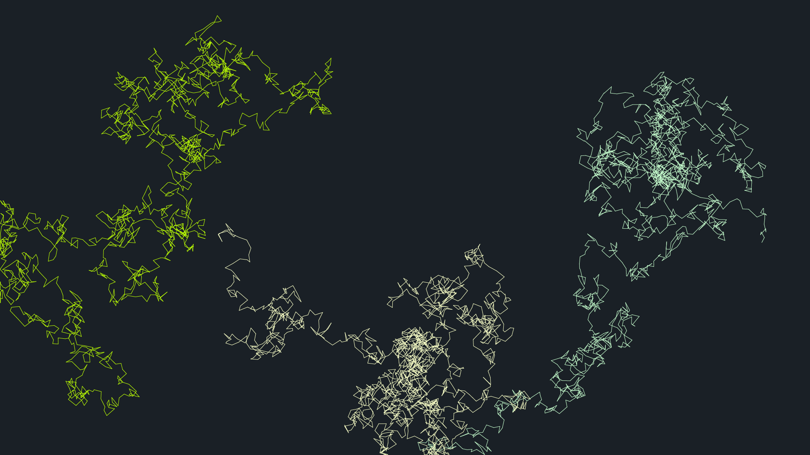

# Generative Art with Adobe Illustrator
This collection of scripts reproduces the p5.js [examples](https://p5js.org/examples/) with Adobe Illustrator's ExtendScript.  
However, since it is not interesting just to reproduce them, some of them are modified.  

## Installation
Download the zip archive and unzip it. The scripts can be placed anywhere on your computer.  
To run the scripts, from File > Scripts > Other Script...  

## Notes
In rare cases, if you continue to use the script, it may stop working.  
In that case, restart Illustrator and run this script again.  

## Requirements
Illustrator CS6 or higher

## Structure
#### [Width and Height](https://p5js.org/examples/structure-width-and-height.html)

#### [Functions](https://p5js.org/examples/structure-functions.html)

#### [Recursion](https://p5js.org/examples/structure-recursion.html)

## Arrays
#### [Array 2D](https://p5js.org/examples/arrays-array-2d.html)

#### [Array Objects](https://p5js.org/examples/arrays-array-objects.html)

## Color
#### [Relativity](https://p5js.org/examples/color-relativity.html)

#### [Lerp Color](https://p5js.org/examples/color-lerp-color.html)

## Math
#### [Distance 2D](https://p5js.org/examples/math-distance-2d.html)

#### [Sine Wave](https://p5js.org/examples/math-sine-wave.html)

#### [Additive Wave](https://p5js.org/examples/math-additive-wave.html)

#### [Double Random](https://p5js.org/examples/math-double-random.html)

#### [Noise Wave](https://p5js.org/examples/math-noise-wave.html)

#### [Random Chords](https://p5js.org/examples/math-random-chords.html)

#### [Parametric Equations](https://p5js.org/examples/math-parametric-equations.html)

## Simulate
#### [Particle System](https://p5js.org/examples/simulate-particle-system.html)

#### [Spirograph](https://p5js.org/examples/simulate-spirograph.html)

#### [Brownian Motion](https://p5js.org/examples/simulate-brownian-motion.html)

# License
All scripts are licensed under the MIT license.  
See the included LICENSE file for more details.  
